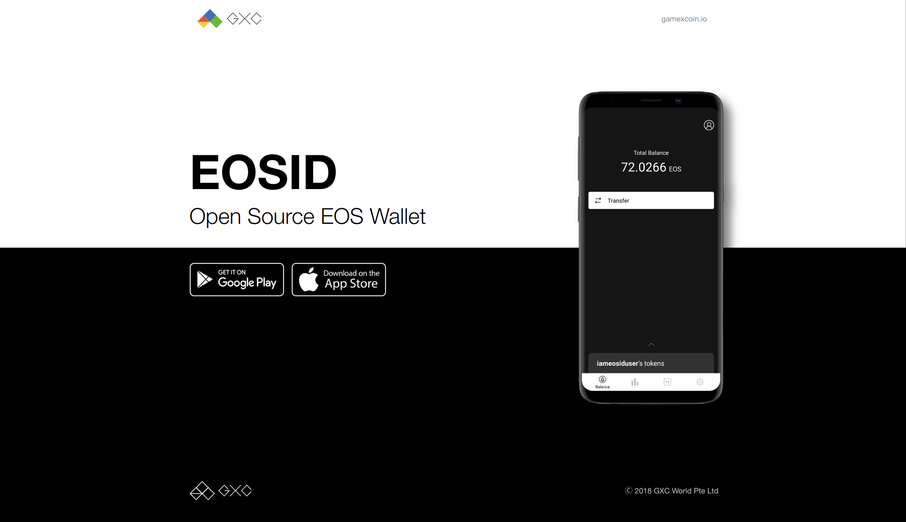

# EOSID

[](https://travis-ci.com/Game-X-Coin/EOSID)

> Open Source EOS Wallet



# Features

- View account balance, tokens
- View historic actions
- View account resources (cpu, net, ram)
- Transfer tokens
- Stake / Unstake resources
- Check refund status
- Support Mainnet & Jungle Testnet

# Download

[Android](https://play.google.com/store/apps/details?id=io.gamexcoin.eosid)

iOS (comming soon)

# Development

## Requirements

**Emulator**

Android Studio (Android) or Xcode (iOS)

**Expo XDE**

> Expo is the easiest way to start building a new React Native application

[Why you need expo?](https://facebook.github.io/react-native/docs/getting-started)

```
$ yarn global add expo-cli
```

## Getting Started

Set env

```
$ cp .env.example .env
```

Install dependencies

```
$ yarn
```

Run EOSID with emulator

```
$ yarn run android

$ yarn run ios
```

Build EOSID

```
$ yarn run build:android

$ yarn run build:ios
```

# License

This project is licensed under the GPLv3 License

[more info](./LICENSE)
